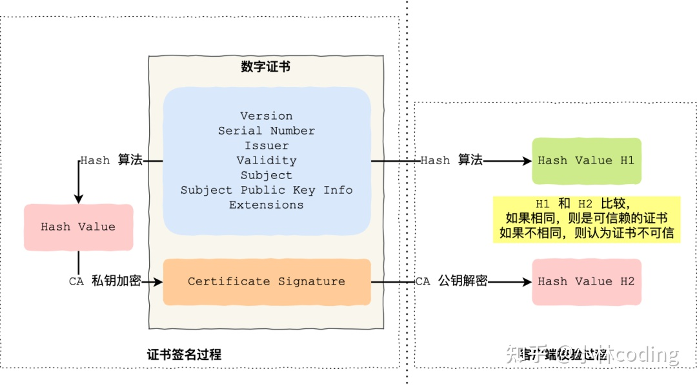

# HTTP
## HTTP 请求方法
  - GET
  - POST
  - HEAD
  - OPTIONS
  - PUT
  - DELETE
  - TRACE
  - CONNECT


## HTTP 状态码
  - 1xx Informational 消息，临时响应
    - **100** *Continue* 客户端应当继续发送请求
    - **101** *Switching Protocols* 服务器已经理解了客户端请求，并通过Upgrade header通知客户端采用不同的协议完成这个请求，如Websocket
      >- `Connection: Upgrade`
      >- `Upgrade: websocket`
    - **102** *Processing* 由WebDAV(RFC 2518)扩展的状态码，代表处理将被继续执行
  - 2xx Successful 成功，表示请求成功被服务器接收并理解
    - **200** *OK* 请求已成功，请求所希望的响应头或数据体随响应返回
    - **201** *Created* 请求已经被实现，而且有一个新的资源已经依据请求的需要而建立，且其 URI 已经随Location 头信息返回
    - **202** *Accepted* 服务器已接受请求，但尚未处理
    - **203** *Non-Authoritative Information* 服务器已成功处理了请求，但返回的实体头部元信息不是在原始服务器上有效的确定集合，而是来自本地或者第三方的拷贝
    - **204** *No Content* 服务器成功处理了请求，但不需要返回任何实体内容，并且希望返回更新了的元信息
    - **205** *Rest Content* 服务器成功处理了请求，且没有返回任何内容，但是与204响应不同，返回此状态码的响应要求请求者重置文档视图
    - **206** *Partial Content* 服务器已经成功处理了部分 GET 请求，该请求必须包含 Range 头信息来指示客户端希望得到的内容范围，并且可能包含 If-Range 来作为请求条件
      >- `Range: bytes=200-100, 2000-3000, 4500-`
      >- `If-Range: <day-name>, <day> <month> <year> <hour>:<minute>:<second> GMT`
      >- `Content-Range: bytes 200-1000/3000 | bytes 200-1000/*`
      >- `Content-Type: MIME`
      >- `Content-Length`
    - **207** *Multi-Status* 由WebDAV(RFC 2518)扩展的状态码，代表之后的消息体将是一个XML消息，并且可能依照之前子请求数量的不同，包含一系列独立的响应代码
  - 3xx Redirection 重定向
    - **301** *Moved Permanently* 被请求的资源已永久移动到新位置，并且将来任何对此资源的引用都应该使用本响应返回的若干个URI之一，默认会被缓存
      >- `Location: <new-url>`
    - **302** *Move Temporarily* 请求的资源临时从不同的URI响应请求，默认以 GET 重新请求
    - **303** *See Other* 对应当前请求的响应可以在另一个 URL 上被找到，而且客户端应当采用 GET 的方式访问那个资源
    - **304** *Not Modified* 如果客户端发送了一个带条件的 GET 请求且该请求已被允许，而文档的内容（自上次访问以来或者根据请求的条件）并没有改变，则服务器应当返回这个状态码
    - **305** *Use Proxy* 被请求的资源必须通过指定的代理才能被访问
    - **306** *Switch Proxy* 在最新版的规范中，306状态码已经不再被使用
    - **307** *Temporary Redirect* 与302一致，但不允许HTTP方法改变
    - **308** *Permanent Redirect* 与301一致，但不允许HTTP方法改变
  - 4xx Client Error 客户端错误
    - **400** *Bad Request* 当前请求无法被服务器理解
      >- `语义有误`
      >- `请求参数有误`
    - **401** *Unauthorized* 当前请求需要用户验证
      >- `Authorization: <type> <credentials>`
      >- `WWW-Authenticate: <type> realm=<realm>`
    - **402** *Payment Required* 该状态码是为了将来可能的需求而预留的
    - **403** *Forbidden* 服务器已经理解请求，但是拒绝执行它
    - **404** *Not Found* 请求失败，请求所希望得到的资源未被在服务器上发现
    - **405** *Method Not Allowed* 请求行中指定的请求方法不能被用于请求相应的资源
      >- `Allow: <http-methods>`
    - **406** *Not Acceptable* 请求的资源的内容特性无法满足请求头中的条件，因而无法生成响应实体
    - **407** *Proxy Authentication Required* 与401响应类似，只不过客户端必须在代理服务器上进行身份验证
      >- `Proxy-Authorization: <type> <credentials>`
    - **408** *Request Timeout* 请求超时
    - **409** *Conflict* 由于和被请求的资源的当前状态之间存在冲突，请求无法完成
    - **410** *Gone* 被请求的资源在服务器上已经不再可用，而且没有任何已知的转发地址
    - **411** *Length Required* 服务器拒绝在没有定义 Content-Length 头的情况下接受请求
    - **412** *Precondition Failed* 服务器在验证在请求的头字段中给出先决条件时，没能满足其中的一个或多个
    - **413** *Request Entity Too Large* 服务器拒绝处理当前请求，因为该请求提交的实体数据大小超过了服务器愿意或者能够处理的范围
    - **414** *Request-URI Too Long* 请求的URI 长度超过了服务器能够解释的长度，因此服务器拒绝对该请求提供服务
    - **415** *Unsupported Media Type* 对于当前请求的方法和所请求的资源，请求中提交的实体并不是服务器中所支持的格式，因此请求被拒绝
    - **416** *Requested Range Not Satisfiable* 如果请求中包含了 Range 请求头，并且 Range 中指定的任何数据范围都与当前资源的可用范围不重合，同时请求中又没有定义 If-Range 请求头，那么服务器就应当返回416状态码
    - **417** *Expectation Failed* 在请求头 Expect 中指定的预期内容无法被服务器满足，或者这个服务器是一个代理服务器，它有明显的证据证明在当前路由的下一个节点上，Expect 的内容无法被满足
      >- `Expect: 100-continue`
    - **418** *I'm a teapot* 超文本咖啡壶控制协议RFC 2324
    - **421** *Misdirected Request* 请求被指向到无法生成响应的服务器（比如由于连接重复使用）
    - **422** *Unprocessable Entity* 请求格式正确，但是由于含有语义错误，无法响应
    - **423** *Locked* 当前资源被锁定
    - **424** *Failed Dependency* 由于之前的某个请求发生的错误，导致当前请求失败
    - **425** *Too Early* 代表服务器不愿意冒风险来处理该请求，原因是处理该请求可能会被“重放”，从而造成潜在的重放攻击
    - **426** *Upgrade Required* 客户端应当切换到TLS/1.0
    - **449** *Retry With* 由微软扩展，代表请求应当在执行完适当的操作后进行重试
    - **451** *Unavailable For Legal Reasons* 该请求因法律原因不可用
  - 5xx Server Error 服务器错误
    - **500** *Internal Server Error* 服务器遇到了一个未曾预料的状况，导致了它无法完成对请求的处理
    - **501** *Not Implemented* 服务器不支持当前请求所需要的某个功能
    - **502** *Bad Gateway* 作为网关或者代理工作的服务器尝试执行请求时，从上游服务器接收到无效的响应
    - **503** *Service Unavailable* 由于临时的服务器维护或者过载，服务器当前无法处理请求
    - **504** *Gateway Timeout* 作为网关或者代理工作的服务器尝试执行请求时，未能及时从上游服务器（URI标识出的服务器，例如HTTP、FTP、LDAP）或者辅助服务器（例如DNS）收到响应
    - **505** *HTTP Version Not Supported* 服务器不支持，或者拒绝支持在请求中使用的 HTTP 版本
    - **506** *Variant Also Negotiates* 由《透明内容协商协议》（RFC 2295）扩展，代表服务器存在内部配置错误
    - **507** *Insufficient Storage* 服务器无法存储完成请求所必须的内容
    - **509** *Bandwidth Limit Exceeded* 服务器达到带宽限制
    - **510** *Not Extended* 获取资源所需要的策略并没有被满足
  - 6xx 同 5xx
    - **600** *Unparseable Response Headers* 源站没有返回响应头部，只返回实体内容

## HTTPS 加密过程


  - HTTP： 直接通过明文在浏览器和服务器之间传递信息
  - HTTPS： 采用 对称加密 和 非对称加密 结合的方式来保护浏览器和服务端之间的通信安全。对称加密算法加密数据+非对称加密算法交换密钥+数字证书验证身份=安全
    >- 对称加密: 加密和解密的秘钥使用的是同一个
    >- 非对称加密: 与对称加密算法不同，非对称加密算法需要两个密钥：公开密钥（publickey）和私有密钥（privatekey）
  - HTTPS = HTTP + TLS/SSL

### 数字证书包含的内容
  - issuer：证书的颁发机构
  - validity (notBefore, notAfter)：证书的生效日期，证书的到期日期
  - subjet，使用者
  - subjectPublickKey：公钥
  - serialNumber：序列号
  - 签名算法
  - 指纹

### 数字证书验证流程

  1. 客户端发起 http 请求，告知服务器自己支持哪些 hash 算法
  2. 服务器把自己的信息以**数字证书**的形式返回给客户端（数字证书内容包含：服务器公钥、服务器网站地址、证书颁发机构、失效日期等）
  3. 验证数字证书合法性：客户端收到服务器的响应后会先验证证书的合法性
     1. 浏览器读取证书中的 issuer（颁发机构），然后在浏览器内置的受信任的发布机构中去找该机构的证书
     2. 若找不到对应机构的证书，则该服务器证书存在问题，程序给出提示
     3. 若找到了对应机构的证书或用户确认使用该证书，使用上级证书的公钥解密本级证书获得数字指纹，再用本级证书的公进行数字摘要算法得到结果与解密获得的数字证书对比，若结果相同则证明证书没有问题


### 算法
  - 非对称加密算法（公钥加密）：有RSA、DSA/DSS、Elgamal、Rabin、D-H、ECC等
  - 对称加密算法（私钥加密）：有AES、DES、3DES、TDEA、Blowfish、RC4、RC5、IDEA等。
  - HASH算法：有MD5，SHA1，SHA256。用来确认信息没有被篡改。

### 证书链
> 证书是分级的，证书链由多个证书一级一级组成，拿到上级证书的公钥才能解密本级证书。只有最底层的证书是自签名的，自己颁发给自己。


## TCP的可靠性传输是如何保证的
  [TCP的可靠性传输是如何保证的](http://blog.alanwu.website/2020/03/07/howToEnsureTcp/)
  > 保证数据安全的方法：TCP主要提供了检验和、序列号/确认应答、超时重传、最大消息长度、滑动窗口控制等方法实现了可靠性传输。


## http与https的区别
  [讲一下 https 和 http 的区别](http://blog.alanwu.website/2020/03/08/https/)
  
  > 首先客户端发起请求到服务端，服务端处理后发送一个公钥给客户端 

  > 客户端进行验证公钥，看公钥是否有效和是否过期 

  > 客户端验证通过会产生随机值key，然后用公钥进行加密回传给服务端 

  > 服务端用私钥解密后获得客户端的随机值key 

  > 利用随机值key加密数据后传输给客户端 

  > 客户端利用key值进行解密数据 

  > 客户端获取真正的数据 

  
  客户端先请求服务端公钥、通过证书验证公钥，接着使用非对称加密交换客户端生成的随机key，再使用随机key对称加密要传输的数据。


## HTTP 2.0有什么新特性
  [HTTP2.0新特性](http://blog.alanwu.website/2020/03/03/http2/)
  > 二进制分帧：<br>
  在应用层和传输层（TLS之上）之间增加一个二进制分帧层，HTTP1.x 的首部信息被封装到 Headers 帧，请求 Body 则封装到 Data 帧。同域名下所有通信都在单个连接上完成，可以承载任意数量的双向数据流，每个数据流都以消息（由一个或多个帧组成，可乱序）的形式发送。 

  > 多路复用：<br>
  HTTP/1.0的模式是，建立连接请求数据完毕之后就立即关闭连接；后来采用了`connection: keep-alive` (HTTP/1.1默认)保活模式使得可以复用连接不断开，可以利用这次连接继续请求数据。（同一个连接内）但是始终会有一个缺点，就是你必须等待服务器返回上一次的请求数据你才可以进行下一次的请求。<br>
  HTTP 2.0就提出了多路复用的技术，就是你可以连续发送多个请求，可以不用收到回复就继续发送请求。优点：并行交错发送请求，请求之间互不影响；TCP连接一旦建立可以并行发送请求；消除不必要延迟，减少页面加载时间；可以最大程度利用HTTP 1.x

  > 首部压缩：<br>
  HTTP 1.x首部是没有压缩的，Gzip只会对请求体进行压缩 <br>
  HTTP 2.0 提供了首部压缩方案。现在SPDY和HTTP 2.0都支持首部压缩，前者使用的是DEFLATE算法，而后者使用专门设计的HPACK算法。首部表在HTTP 2.0 的连接存续期内始终是有效的，客户端和服务端共同更新，头部帧可以最大程度的复用

  > 流量控制：<br>
  HTTP 2.0 “流” 的流量控制最终的目标是在不改变协议的情况之下允许采用多种流量控制算法。

  > 请求优先级： <br>
  客户端可以通过在打开流的HEADERS帧中包含优先次序信息来为一个新流指定优先级。在其它任意时间，可以使用PRIORITY帧来改变流的优先级。

  > 服务器推送：<br>
  HTTP 2.0 可以使服务器主动返回资源给客户端用户。
  服务端接收到客户端主请求，能够“预测”主请求的依赖资源，在响应主请求的同时，主动并发推送依赖资源至客户端。

## HTTP/3
  [如何看待 HTTP/3 ？](https://www.zhihu.com/question/302412059)
  > 基于 UDP 协议，QUIC / TLS1.3 协议

## 常见HTTP首部
### 通用首部
  - Request URL: 浏览器当前的请求地址
  - Request Method: 请求方法
  - Status Code: 状态码
  - Remote Address: 请求的远程地址,ip地址+端口
  - Referrer Policy: 监管访问信息来源
    - no-referrer: 整个首部会被移除,访问来源信息不随着请求一起发送。
    - no-referrer-when-downgrade: (默认值)
    - origin: 发送源文件的引用地址
    - origin-when-cross-origin: 对于同源的请求,会发送完整URL作为引用地址,对于非同源仅发送文件的源
    - same-origin: 对于同源的请求会发送引用地址,对于非同源的请求仅发送文件的源
    - strict-origin:
    - strict-origin-when-cross-origin:
    - unsafe-url: 无论同源&非同源,都发送URL(移除参数信息之后)作为引用地址
  
### 请求首部
  - Accept: 用来告知客户端可以处理的内容类型,这种用MIME类型来表示
    ```
    Accept: text/html, application/xhtml+xml, application/xml;q=0.9, */*;q=0.8
    // ;q=(q因子权重)
    ```
  
  - Accept-Encoding: 会将客户端能够理解的内容编码方式(通常是某种压缩算法),并且通过内容协商的方式。服务端会选择一个客户端的提议,并在响应报文首部Content-Encoding中通知客户端选择
    ```
    Accept: 
      gzip:
      compress:
      deflate:
      br:
      identity: 指代自身。除非特别表明,这个标记始终可以被接受
      *:
      ;q: 权重
    ```

  - Accept-Language: 表示请求头在客户端声明它可以理解的自然语言,借助内容协商机制,服务端在选项中选择一项,并使用Content-Language应答头通知客户端的选择
    ```
    Accept-Language:
      <language>: 含有两个到三个字符串的语言码
      <locale>: 完整的语言标签
      * 任意语言
      ;q:表权重
    ```
  - Accept-Charset: 可接受的字符集
  - Authorization: 用于表示HTTP协议中需要认证资源的认证信息
  - Connection: 决定当前事务完成后,是否会关闭网络连接
    ```
    Connection:
      keep-alive
      transfer-Encoding
      TE
      Connection
    ```

  - Cookie: 随请求发送的 cookie
  - Host: 本机地址
  - Referer: 通过 window.location.href 获取地址附加到referrer中，请求当前地址的源地址
  - User-Agent: 用户请求的信息,包含浏览器信息等
  - Origin: 标准浏览器只要是跨域就会携带此请求头字段，如果后台允许此字段的地址，则正常请求，如果不允许，浏览器就会abort，不产生事件，就好像没有请求过，network也看不到


### 响应首部
  - Cache-Control: 通用消息头被用于在Http请求和响应中通过指令来实现缓存机制
    ```
    Cache-Control:
      可缓存性:
        public: 表明响应可以被任何对象缓存
        private: 表明响应只能被单个用户缓存,不能作为共享缓存
        no-cache: 强制缓存的用户,在使用已存储的缓存数据前,发送带验证的请求到原始服务器
        only-if-cached: 表明如果缓存存在,只是用缓存
      
      到期:
        max-age=<seconds>: 设置缓存的最大周期,超过则为过期,单位为秒

      重新验证:
        must-revalidate: 缓存必须在使用之前验证旧资源的状态,并且不可使用过期资源

      其他:
        no-store: 缓存不应存储有关客户端和服务器的任何内容
        no-transform: 不得对资源进行转换或转变
      
      
      Cache-Control: no-cache,no-store,must-revalidate // 禁止缓存
      Cache-Control: public,max-age=31536000 // 缓存静态资源
    ```

  - Connection: 同请求首部的 Connection
  - Content-length: 是一个实体消息首部,用来指明发送给接收方的消息主体的大小（bytes）
  - Content-Type: 请求返回消息的内容格式 MIME
    ```
    Content-Type:
      application/x-www-form-urlencoded; charset=utf-8
      multipart/form-data; boundary=something
      application/json; charset=utf-8
      text/xml,text/html; charset=utf-8
    ```
  - Location: 需要将页面重新定向至的地址，一般在响应码为3xx的响应中才会有意义
  - Set-Cookie: 服务器端向客户端设置 cookie
    ```
    Set-Cookie: <cookie-name>=<cookie-value>
    Set-Cookie: <cookie-name>=<cookie-value>; Expires=<date>
    Set-Cookie: <cookie-name>=<cookie-value>; Max-Age=<non-zero-digit>
    Set-Cookie: <cookie-name>=<cookie-value>; Domain=<domain-value>
    Set-Cookie: <cookie-name>=<cookie-value>; Path=<path-value>
    Set-Cookie: <cookie-name>=<cookie-value>; Secure
    Set-Cookie: <cookie-name>=<cookie-value>; HttpOnly

    Set-Cookie: <cookie-name>=<cookie-value>; SameSite=Strict
    Set-Cookie: <cookie-name>=<cookie-value>; SameSite=Lax

    // Multiple directives are also possible, for example:
    Set-Cookie: <cookie-name>=<cookie-value>; Domain=<domain-value>; Secure; HttpOnly
    ```

### CORS 跨域相关 headers
简单请求：请求方式只能是：head，get，post；请求头允许的字段：Accept，Accept-Language，Content-Language，Last-Event-ID
Content-Type：application/x-www-form-urlencoded、multipart/form-data、text/plain 三选一

复杂请求：不满足简单请求的条件，options 预检测

- #### 请求
  - Access-Control-Request-Method: 该次请求的请求方式
  - Access-Control-Request-Headers: 该次请求的自定义请求头字段

- #### 响应
  - Access-Control-Allow-Origin: 允许哪个域的请求。如果服务器不通过，根本没有这个字段，接着触发XHR的onerror，（`"*"`，指定域，动态设置）
  - Access-Control-Allow-Credentials: 是否允许后续请求携带认证信息（cookies），该值只能是 true，否则不返回，Origin 设置为 `"*"` 时不发送 cookies
  - Access-Control-Allow-Method: 允许的请求类型
  - Access-Control-Allow-Headers: 允许的请求头字段
  - Access-Control-Max-Age: 预检结果缓存时间，当对时间（秒）
  - Access-Control-Expose-Headers: CORS请求时，XMLHttpRequest对象的getResponseHeader()方法只能拿到7个基本字段：Cache-Control、Content-Language、Content-Length、Content-Type、Expires、Last-Modified、Pragma。如果想拿到其他字段，就必须在Access-Control-Expose-Headers里面指定

### Range 相关请求头
- #### 请求
  - Range: 请求数据范围
    ```
    Range: bytes=start-end // [start, end] 字节范围的数据，包括 start 和 end 
    Range: bytes=start- // 从 start 到结束的数据
    ```

- #### 响应
  - Content-Range: 返回的数据信息
    ```
    Content-Range: bytes start-end/total // 开始-结束/总大小
    Content-Range: bytes start-end/* // 未知总大小
    ```
  - Content-Type: 资源类型 MIME


## 服务端推送
  - WebSocket
  - Server-Sent Events (EventSource)

### get、post的区别
  [GET和POST的区别](https://www.zhihu.com/question/28586791)
  > GET：query 传参，幂等性：一次或多次操作返回结果相同 

  > POST：query/body 传参 

  > 一般对 GET 缓存，很少对 POST 缓存

### 你所知道的http的响应码及含义？
  > 101：切换协议，WebSockets 

  > 206：部分成果，header: range 

  > 304：请求的资源未被更改 

  > 400、401、403、404 

  > 500、502、504


### get请求传参长度的误区
> 误区：我们经常说get请求参数的大小存在限制，而post请求的参数大小是无限制的。

实际上HTTP 协议从未规定 GET/POST 的请求长度限制是多少。

对get请求参数的限制是来源与浏览器或web服务器，浏览器或web服务器限制了url的长度。

为了明确这个概念，我们必须再次强调下面几点:
  - HTTP 协议 未规定 GET 和POST的长度限制
  - GET的最大长度显示是因为 浏览器和 web服务器限制了 URI的长度
  - 不同的浏览器和WEB服务器，限制的最大长度不一样